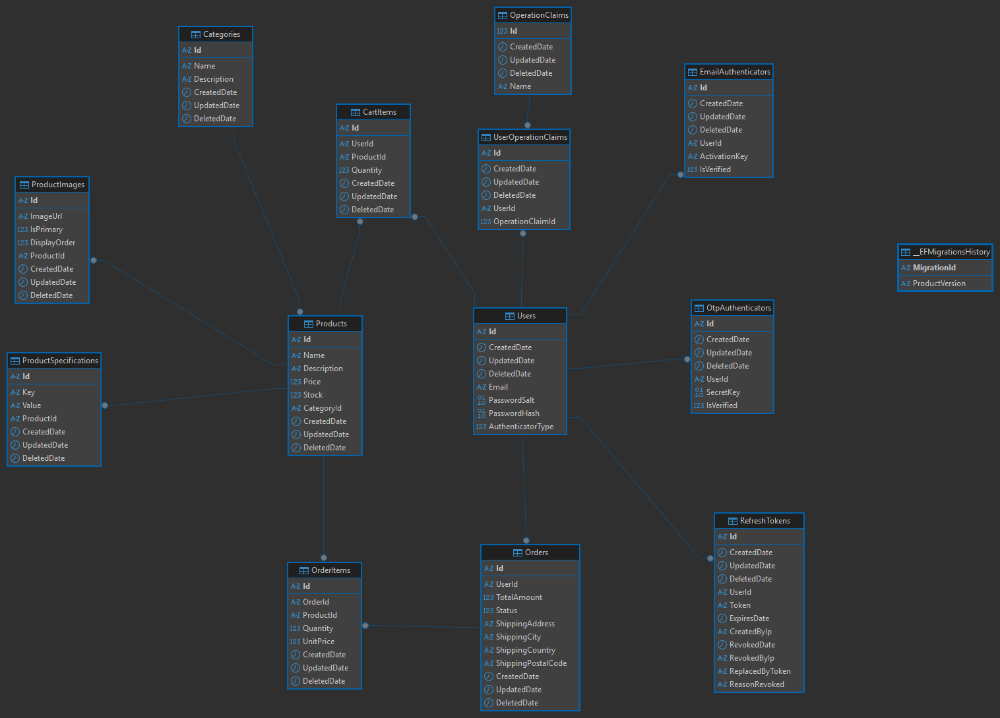

# E-Commerce Platform

A full-stack e-commerce application built with **Clean Architecture principles**, featuring a scalable backend API with **CQRS pattern** and a modern React-based admin panel and storefront.

## 🚀 Live Demo

- **Frontend Application**: [https://alikemaluysal.github.io/ECommerce/#/](https://alikemaluysal.github.io/ECommerce/#/)
- **Swagger**: [https://api-ecommerce.alikemaluysal.com/swagger/index.html](https://api-ecommerce.alikemaluysal.com/swagger/index.html)

## 📋 Table of Contents

- [Project Overview](#project-overview)
- [Database Design](#database-design)
- [Technology Stack](#technology-stack)
- [Features](#features)
- [Getting Started](#getting-started)

## Project Overview

This simple e-commerce platform demonstrates modern software architecture and development practices:

### What is This Project?

A **complete e-commerce solution** that includes:

- **Backend API** built with ASP.NET Core 8.0 following Clean Architecture
- **Frontend SPA** using React 19 with TypeScript for both customer storefront and admin panel
- **RESTful API** with comprehensive Swagger documentation
- **JWT-based authentication** with role-based authorization
- **CQRS pattern** implementation using MediatR
- **Repository pattern** for data access abstraction

### Key Capabilities

**For Customers:**
- Browse products by categories
- Add items to shopping cart with persistent storage
- Complete checkout process with order tracking
- Look up orders using order number

**For Administrators:**
- Manage products, categories, and inventory
- Process and track customer orders
- View sales statistics and analytics
- Full CRUD operations via admin dashboard

### Architecture Highlights

The application follows **Clean Architecture** with clear separation of concerns:

- **Domain Layer**: Core business entities and rules
- **Application Layer**: Business logic with CQRS handlers (Commands & Queries)
- **Infrastructure Layer**: External service integrations (Email, Logging, ElasticSearch)
- **Persistence Layer**: Data access with Entity Framework Core and Repository Pattern
- **Presentation Layer**: RESTful API controllers with Swagger documentation

**Design Patterns Used:**
- CQRS (Command Query Responsibility Segregation)
- Repository Pattern
- Mediator Pattern
- Unit of Work
- Dependency Injection


## Database Design

The database is designed using a **relational model** with normalized tables, ensuring data integrity and optimal query performance.

### Entity Relationship Diagram




## Technology Stack

### Backend Technologies

| Category | Technology |
|----------|-----------|
| **Framework** | ASP.NET Core 8.0 |
| **Language** | C# 12 |
| **ORM** | Entity Framework Core |
| **Database** | Microsoft SQL Server |
| **Authentication** | JWT Bearer Tokens |
| **Architecture** | Clean Architecture + CQRS |
| **Mediator** | MediatR |
| **Validation** | FluentValidation |
| **Logging** | Serilog |
| **Search Engine** | ElasticSearch |
| **API Documentation** | Swagger/OpenAPI (Swashbuckle) |
| **Testing Framework** | xUnit, Moq |
| **Dependency Injection** | Built-in .NET DI Container |

### Frontend Technologies

| Category | Technology |
|----------|-----------|
| **Framework** | React 19 |
| **Language** | TypeScript |
| **Build Tool** | Vite |
| **Routing** | React Router v7 |
| **HTTP Client** | Axios |
| **UI Components** | Radix UI |
| **Styling** | Tailwind CSS 4 |
| **Icons** | Lucide React |
| **Notifications** | Sonner (Toast) |
| **State Management** | React Context API |
| **Form Handling** | React Hooks |


## Getting Started

### Prerequisites
- **.NET 8.0 SDK** or later
- **Node.js 18+** and npm
- **SQL Server 2019+** (or SQL Server Express)
- **Git**

### Quick Start

#### 1. Clone Repository
```bash
git clone https://github.com/alikemaluysal/ECommerce.git
cd ECommerce
```

#### 2. Backend Setup
```bash
cd backend/src/eCommerce/WebAPI

# Update connection string in appsettings.json
# "BaseDb": "Server=localhost;Database=ECommerceDb;Trusted_Connection=True;"

# Apply database migrations
dotnet ef database update --project ../Persistence

# Run the API
dotnet run
```
API will be available at: `https://localhost:7001`  
Swagger UI: `https://localhost:7001/swagger`

#### 3. Frontend Setup
```bash
cd frontend

# Install dependencies
npm install

# Update API URL in src/api/client.ts if needed
# const API_URL = 'https://localhost:7001/api';

# Start development server
npm run dev
```
Application will be available at: `http://localhost:5173`

### Default Credentials
**Admin Account:**
```
Email: admin@alikemaluysal.com
Password: 112
```

### Running Tests
```bash
# Backend tests
cd backend/tests/ECommerce.Application.Tests
dotnet test

# Frontend linting
cd frontend
npm run lint
```

## Deployment

**Backend:**
- Production-ready on cloud infrastructure
- HTTPS with SSL certificates
- Environment-based configuration
- Database backups and monitoring

**Frontend:**
- GitHub Pages static hosting
- Optimized production builds
- CDN-enabled for global performance

## Contributing

Contributions are welcome! Please follow these steps:

1. **Fork** the repository
2. **Create** a feature branch (`git checkout -b Feature/AmazingFeature`)
3. **Commit** your changes using [semantic commit messages](./docs/Semantic%20Commit%20Messages.md)
   ```bash
   git commit -m 'feat(products): add bulk import feature'
   ```
4. **Push** to your branch (`git push origin Feature/AmazingFeature`)
5. **Open** a Pull Request

## License

Distributed under the **MIT License**. See `LICENSE` for more information.

## Contact

**Ali Kemal Uysal**
- 📧 Email: [alikemaluysal4235@gmail.com](mailto:alikemaluysal4235@gmail.com)
- 🐙 GitHub: [@alikemaluysal](https://github.com/alikemaluysal)

## Acknowledgements

- [**NArchitecture**](https://github.com/kodlamaio-projects/nArchitecture) - Clean Architecture framework and foundation

---

<div align="center">

**Built with ❤️ using Clean Architecture principles**

⭐ Star this repository if you find it helpful!

</div>